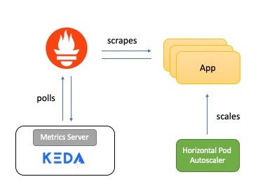

## Kubernetes app auto-scaling with Prometheus and KEDA

Scalability is a key requirement for cloud native applications. With [Kubernetes](https://kubernetes.io), scaling your application is as simple as increasing the number of replicas for the corresponding `Deployment` or `ReplicaSet` - but, this is a manual process. Kubernetes makes it possible to automatically scale your applications (i.e. `Pod`s in a `Deployment` or `ReplicaSet`) in a declarative manner using the [Horizontal Pod Autoscaler](https://kubernetes.io/docs/reference/generated/kubernetes-api/v1.16/#horizontalpodautoscaler-v1-autoscaling) specification.

[This blog post](https://dev.to/azure/how-to-auto-scale-your-kubernetes-apps-with-prometheus-and-keda-39km) demonstrates how you can external metrics to auto-scale a Kubernetes application. For demonstration purposes, we will use HTTP access request metrics that are exposed using [Prometheus](https://prometheus.io). Instead of using the `Horizontal Pod Autoscaler` directly, we will leverage [**Kubernetes Event Driven Autoscaling** aka **KEDA**](https://github.com/kedacore/keda) - an open source Kubernetes operator which integrates natively with the `Horizontal Pod Autoscaler` to provide fine grained autoscaling (including to/from zero) for event-driven workloads.